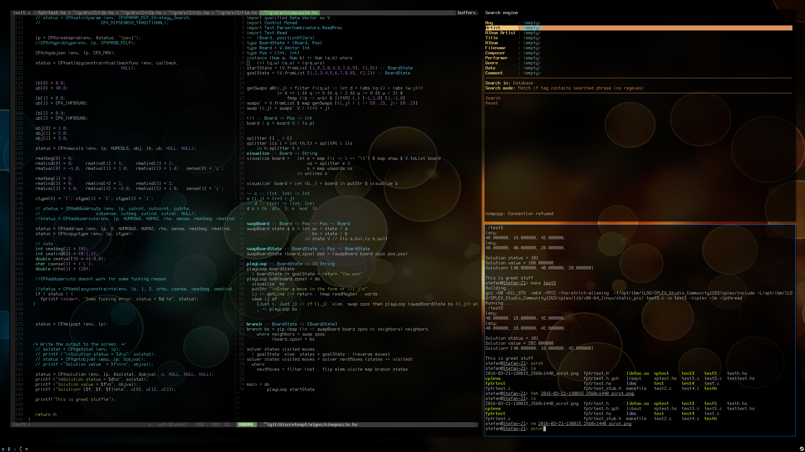

# Dot Files
Dot Files - i3 config and vim

*Preview:*


## Packer

Installing packer

```
sudo pacman -S wget
cd ~/Downloads
wget https://aur.archlinux.org/cgit/aur.git/snapshot/packer.tar.gz
tar -xvf packer.tar.gz
cd packer
makepkg -sri
```

## I3
i3 configuration
### Install script

Install necessary apps

```
pacman -S i3 feh rxvt-unicode ttf-droid terminus-font compton zsh-syntax-highlighting zsh
```

Install i3-gaps, dmenu2 and some fonts

```
packer -S i3-gaps-git dmenu2 powerline-fonts-git unclutter-xfixes-git
```

---


### Installation notes

`.Xresources` goes to `~/.Xresources`

```
xrdb -merge ~/.Xresources
```

Make sure `xrdb -merge ~/.Xresources` is above `exec i3` in `~\.xinitrc`


`.conkyrc` goes to `~/.conkyrc`

`config` goes to `~/.i3/config`

`zixpk.jpg` can go to the home directory `~/zixpk.jpg`
Just update the path as necessary in `~/.i3/config`


Copy the .fonts to ~/.fonts/
then 
```
xset fp+ $HOME/.fonts/misc
xset fp+ $HOME/.fonts/ohsnap
xset fp+ $HOME/.fonts/terminesspowerline
fc-cache -vf
```

## VIM and haskell

Install vim plugins
```
$ git clone https://github.com/gmarik/Vundle.git ~/.vim/bundle/Vundle.vim
$ vim +PluginInstall +qall
```

Install pathogen
```
packer -S vim-pathogen
```


Install haskell plugins
```
cd ~/.vim/bundle
git clone https://github.com/eagletmt/ghcmod-vim.git
git clone https://github.com/eagletmt/neco-ghc
git clone https://github.com/ctrlpvim/ctrlp.vim.git
git clone https://github.com/scrooloose/syntastic.git
git clone https://github.com/tomtom/tlib_vim.git
git clone https://github.com/MarcWeber/vim-addon-mw-utils.git
git clone https://github.com/garbas/vim-snipmate.git
git clone https://github.com/scrooloose/nerdtree.git
git clone https://github.com/scrooloose/nerdcommenter.git
git clone https://github.com/godlygeek/tabular.git
git clone https://github.com/ervandew/supertab.git
git clone https://github.com/Shougo/neocomplete.vim.git
git clone https://github.com/Shougo/vimproc.vim.git
git clone https://github.com/kristijanhusak/vim-hybrid-material
git clone https://github.com/vim-airline/vim-airline
git clone https://github.com/vim-airline/vim-airline-themes
cd vimproc.vim
make
cabal install ghc-mod hlint
```
